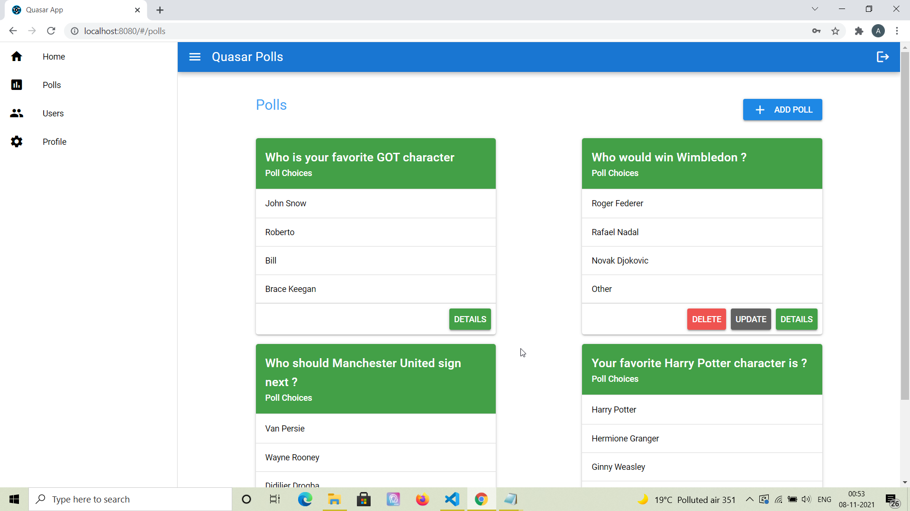
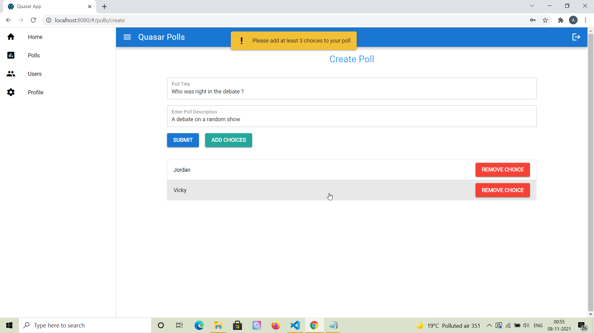
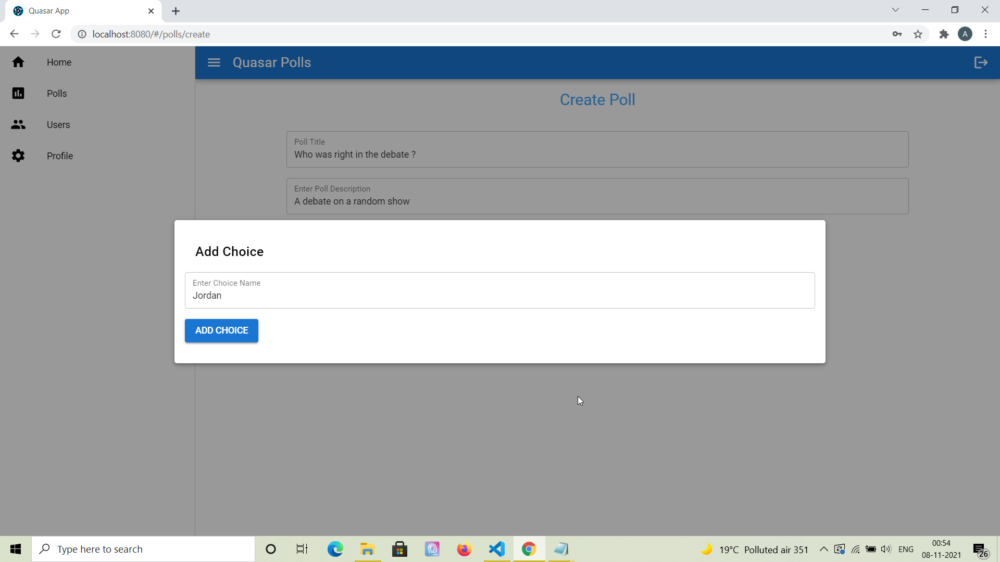

# User Polls App - Web application for creating and voting on public polls ⚡️

## Project Briefing

This is a polls application similar to what you create as a sample application when you learn Django through Django docs. It is a multi-user system in which each user can create polls and add choices. Other users on the forum would then be able to search polls and vote on them. The polls on which a given user has voted would be displayed on the dashboard page of the user logged in. The project is still in progress and the requirements are still in development. It is created in MEVN stack using latest version of Vue and Typescript.

Made with ❤️ by **[@apfirebolt](https://github.com/Apfirebolt/)**
## Requirements

- Contains token based user auth system. 
- Each user can perform CRUD on Polls.
- Each poll would have choices, choices can be anywhere between 3 to 10.
- Users would be able to see which users voted on what option on each poll, they would also be able to search for polls and vote.
- User Search functionality added, users can be searched and on clicking it would redirect to their detail page.
- On the details page of the user, all polls created by the user would be displayed in tabular format.

## Built With

* [Express](https://expressjs.com/)
* [Vue 3](https://v3.vuejs.org/)
* [MongoDB](https://www.mongodb.com/)
* [Mongoose ORM](https://mongoosejs.com/)
* [Typescript](https://www.typescriptlang.org/)
* [Quasar UI Kit](https://quasar.dev/)

## Project setup

Simply install node modules for both frontend and backend, the project is already configured to serve build content files in production which is generated by Vue which resides inside the build folder.

Concurrently, a package is used for development and allows us to launch both frontend and back-end in one go using single command. Alternatively, in dev mode you can run both the applications on separate ports, cors is enabled in this project for the back-end.

```
npm install
npm run dev
```

For production, build the frontend of the app and then run the backend app only. 

```
npm run build
quasar dev
```

```bash
quasar build
```

### Customize the configuration
See [Configuring quasar.conf.js](https://quasar.dev/quasar-cli/quasar-conf-js).
## Database Architecture

- MongoDB is used as database which works pretty smoothly with Javascript and other Javascript frameworks. 
- Mongoose ORM is used to define document schemas and perform 
complex queries.
- It has 2 models namely 'User' and 'Polls'.
- Nested or Embedded documents is used for Choices within a poll.

## Project Screenshots

Screenshots of few pages which are less likely to change in terms of design are added.

Below is the screenshot of the Poll List page, it shows how polls would be displayed, there might be minor changes in it like who opened it and more in future.



Adding a poll screenshot



Adding choices in the poll while creating it through modals.



